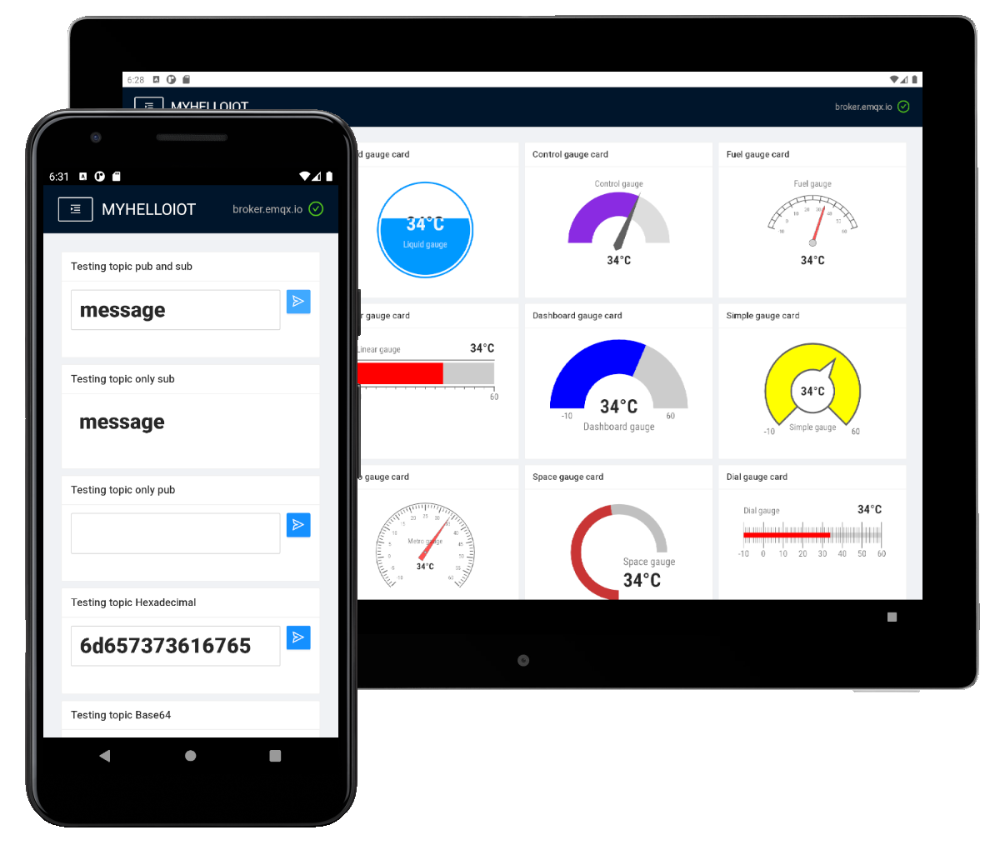

# MYHELLOIOT

MYHELLOIOT is a [MQTT](https://en.wikipedia.org/wiki/MQTT) dashboard application inspired in my other MQTT project [HelloIoT](https://github.com/adrianromero/helloiot)
You can use MYHELLOIOT as a MQTT client application to publish and subscribe to topics or you can use MYHELLOIOT as a client platform to create your own dashboard. MYHELLOIOT is a [PWA](https://en.wikipedia.org/wiki/Progressive_web_application) application and it can run on your favorite browser or installed on Windows, MacOS, Linux, and even in mobile devices iOS or Android.



# Getting started

## Execute and install MYHELLOIOT

To execute MYHELLOIOT just open your browser and go to [MYHELLOIOT](https://adrianromero.github.io/myhelloiot/). And if you want to install it, in the browser menu select _Install application_.

## Install a MQTT Broker

To run MYHELLOIOT you need to install a MQTT broker or you can use a public MQTT broker. Public MQTT brokers can be good for testing or prototyping purposes. There is a list of MQTT brokers in the [MQTT Community Wiki](https://github.com/mqtt/mqtt.github.io/wiki/servers), you can choose the broker that better fits your needs. The broker must support WebSockets/SSL.

For example MYHELLOIOT has been verified to work with the public brokers by [EMQX](https://www.emqx.io/mqtt/public-mqtt5-broker) and [Mosquitto](https://test.mosquitto.org/)

If you prefer to install it there are several options available like [Mosquitto](http://mosquitto.org/) [HiveMQ](http://www.hivemq.com/), [EMQTT](http://emqtt.io/),
[Moquette](https://github.com/andsel/moquette) and more...

## Execute MYHELLOIOT from sources

If you prefer to run MYHELLOIOT from sources clone the repository and start. You will need and node and yarn installed first.

```
git clone https://github.com/adrianromero/myhelloiot
cd ./myhelloiot
yarn install
yarn start
```

# Other MQTT tools

In the [MQTT Community Wiki](https://github.com/mqtt/mqtt.github.io/wiki/tools), you can find a list of client applications and tools.

# Acknowledges

Creative Commons 0 Licensed sound effects obtained from https://freesound.org/

# License

MYHELLOIOT is licensed under the GNU General Public License, Version 3, 29 June 2007.

Copyright (C) 2021-2024 Adrián Romero.
